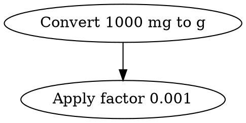

# Conversions API Documentation

## Overview

The Conversions API provides endpoints for unit conversions with confidence scoring, unit validation, and compatibility checking. This API is designed to support medication dosage conversions with clinical confidence levels.

## Base URL

- Development: `http://localhost:5173/api/v2`
- Production: `https://your-api-domain.com/api/v2`

## Authentication

Currently, no authentication is required. In production, you should implement appropriate authentication and rate limiting.

## Endpoints

### 1. Calculate Conversion Confidence

Performs a unit conversion and calculates a confidence score for the result.

**Endpoint:** `POST /conversions/confidence`

**Request Body:**
```json
{
  "value": 1000,
  "fromUnit": "mg",
  "toUnit": "g",
  "context": {
    "medicationId": "med-123",
    "lotNumber": "LOT-2024-001",
    "strengthRatio": {
      "numerator": { "value": 100, "unit": "mg" },
      "denominator": { "value": 2, "unit": "mL" }
    },
    "customConversions": [
      {
        "deviceUnit": "{tablet}",
        "factor": 100
      }
    ]
  },
  "options": {
    "enableTrace": true,
    "traceFormat": "json"
  }
}
```

**Response (200 OK):**
```json
{
  "confidence": {
    "score": 0.95,
    "level": "high",
    "rationale": [
      "Direct conversion between units",
      "Using UCUM standard units"
    ],
    "factors": {
      "complexity": 0.95,
      "dataCompleteness": 1.0,
      "precision": 1.0
    }
  },
  "conversion": {
    "from": { "value": 1000, "unit": "mg" },
    "to": { "value": 1, "unit": "g" },
    "steps": [
      "Convert 1000 mg to g using factor 0.001"
    ]
  },
  "metadata": {
    "calculatedAt": "2024-01-15T10:30:00.000Z",
    "version": "2.0.0",
    "traceId": "conv-1705317000000-abc123def"
  },
  "trace": "{ \"traces\": [...], \"summary\": {...} }"
}
```

**Error Response (400 Bad Request):**
```json
{
  "error": "InvalidUnitError",
  "message": "Invalid unit 'invalid-unit': Not found in UCUM database",
  "traceId": "conv-1705317000000-abc123def",
  "details": {
    "suggestions": ["mg", "mcg", "g"]
  }
}
```

#### Request Parameters

| Field | Type | Required | Description |
|-------|------|----------|-------------|
| value | number | Yes | The numeric value to convert |
| fromUnit | string | Yes | Source unit (UCUM or device unit) |
| toUnit | string | Yes | Target unit (UCUM or device unit) |
| context | object | No | Additional context for conversion |
| context.medicationId | string | No | Medication identifier |
| context.lotNumber | string | No | Lot number for lot-specific conversions |
| context.strengthRatio | object | No | Concentration for mass/volume conversions |
| context.customConversions | array | No | Custom device unit conversions |
| options | object | No | Conversion options |
| options.enableTrace | boolean | No | Include detailed trace (default: false) |
| options.traceFormat | string | No | Trace format: "json", "dot", or "text" |

#### Confidence Levels

- **high** (≥0.9): Highly reliable, suitable for clinical use
- **medium** (≥0.7): Reasonably reliable, verify for critical dosing
- **low** (≥0.5): Significant uncertainty, manual verification recommended
- **very-low** (<0.5): Unreliable, do not use without verification

### 2. Validate Units

Validates multiple unit strings and provides normalization and suggestions.

**Endpoint:** `POST /units/validate`

**Request Body:**
```json
{
  "units": ["mg", "miligram", "{tablet}", "xyz"]
}
```

**Response (200 OK):**
```json
{
  "results": [
    {
      "unit": "mg",
      "valid": true,
      "normalized": "mg",
      "type": "standard"
    },
    {
      "unit": "miligram",
      "valid": false,
      "error": "Not found in UCUM database",
      "suggestions": ["mg", "milligram"]
    },
    {
      "unit": "{tablet}",
      "valid": true,
      "normalized": "{tablet}",
      "type": "device"
    },
    {
      "unit": "xyz",
      "valid": false,
      "error": "Invalid unit format"
    }
  ]
}
```

### 3. Get Compatible Units

Returns all units that are compatible (convertible) with a given unit.

**Endpoint:** `POST /units/compatible`

**Request Body:**
```json
{
  "unit": "mg"
}
```

**Response (200 OK):**
```json
{
  "unit": "mg",
  "compatibleUnits": [
    {
      "code": "mg",
      "display": "milligram",
      "isCustom": false,
      "dimension": "mass"
    },
    {
      "code": "g",
      "display": "gram",
      "isCustom": false,
      "dimension": "mass"
    },
    {
      "code": "mcg",
      "display": "microgram",
      "isCustom": false,
      "dimension": "mass"
    },
    {
      "code": "{tablet}",
      "display": "tablet",
      "isCustom": true,
      "dimension": "mass"
    }
  ]
}
```

## Error Handling

All endpoints return consistent error responses:

```json
{
  "error": "ErrorType",
  "message": "Human-readable error message",
  "traceId": "Unique trace identifier",
  "details": {
    // Additional error-specific details
  }
}
```

Common error types:
- `InvalidUnitError`: Unit string is invalid
- `IncompatibleUnitsError`: Units cannot be converted
- `MissingContextError`: Required context missing for conversion
- `ImpossibleConversionError`: Conversion is mathematically impossible
- `PrecisionError`: Result would lose too much precision

## Trace Formats

When `enableTrace` is true, the API includes detailed conversion traces in the requested format:

### JSON Format
Complete structured data with all trace events, timings, and metadata.

### DOT Format
GraphViz DOT notation for visualizing the conversion path:


### Text Format
Human-readable trace with timing information:
```
=== Conversion Trace ===
Total Duration: 2.34ms
Events: 5

--- Convert 1000 mg to g ---
[0.12ms] Validating input units
[0.45ms] Using device adapter for conversion
[1.23ms]   Convert mg to g using factor 0.001
[1.89ms] Calculating confidence score
[2.34ms] Conversion complete [result=1, confidence=0.95]
```

## Client Libraries

### JavaScript/TypeScript

Use the provided React hook:
```typescript
import { useConversionAPI } from '@/hooks/useConversionAPI';

function MyComponent() {
  const { calculateConfidence, loading, error } = useConversionAPI();
  
  const convert = async () => {
    const result = await calculateConfidence({
      value: 1000,
      fromUnit: 'mg',
      toUnit: 'g'
    });
    
    if (result) {
      console.log(result.conversion.to.value); // 1
      console.log(result.confidence.level);    // "high"
    }
  };
}
```

### Direct API Calls

```javascript
const response = await fetch('/api/v2/conversions/confidence', {
  method: 'POST',
  headers: {
    'Content-Type': 'application/json'
  },
  body: JSON.stringify({
    value: 1000,
    fromUnit: 'mg',
    toUnit: 'g'
  })
});

const result = await response.json();
```

## Rate Limiting

In production, implement rate limiting:
- 100 requests per minute per IP for unauthenticated requests
- 1000 requests per minute for authenticated users

## Deployment

The API can be deployed as:

1. **Serverless Functions** (Recommended)
   - Deploy to AWS Lambda, Vercel, Netlify Functions
   - Each endpoint as a separate function
   - Auto-scaling and pay-per-use

2. **Node.js Server**
   - Express.js or Fastify integration
   - Use the exported handler functions

3. **Edge Functions**
   - Deploy to Cloudflare Workers or Deno Deploy
   - Low latency global distribution

## Monitoring

Recommended metrics to track:
- Conversion success rate
- Average confidence scores
- Error rates by type
- Response times (P50, P95, P99)
- Most common unit conversions