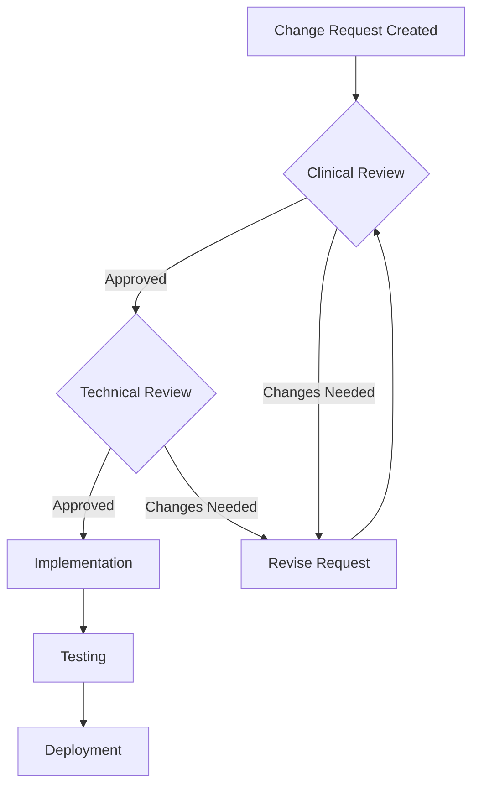

# Clinical Guardrails Change Management Process

## Overview

This document establishes the formal process for reviewing, approving, and deploying changes to clinical guardrails in the Medication Signature Builder. All changes to the `src/guardrails/schema.yaml` file must follow this process to ensure patient safety and regulatory compliance.

## Table of Contents

1. [Change Request Process](#change-request-process)
2. [Two-Sign-Off Workflow](#two-sign-off-workflow)
3. [Technical Validation Requirements](#technical-validation-requirements)
4. [Deployment Procedures](#deployment-procedures)
5. [Audit Trail Requirements](#audit-trail-requirements)
6. [Emergency Procedures](#emergency-procedures)
7. [Review Cycles](#review-cycles)

## Change Request Process

### 1. Initiating a Change Request

All guardrail changes must be initiated through a formal change request that includes:

- **Clinical Justification**: Evidence-based rationale for the change
- **Impact Analysis**: Affected medications, patient populations, and downstream systems
- **Risk Assessment**: Potential patient safety implications
- **Testing Plan**: How the change will be validated
- **Rollback Strategy**: How to revert if issues arise

### 2. Change Request Template

```yaml
# GUARDRAIL CHANGE REQUEST
# File: .github/ISSUE_TEMPLATE/guardrail-change-request.yml

change_request:
  id: "GCR-2024-001"
  date: "2024-01-15"
  requestor:
    name: "Dr. Jane Smith"
    role: "Clinical Pharmacist"
    email: "jane.smith@hospital.org"
  
  clinical_justification:
    reason: "Updated FDA guidance on maximum daily dose"
    evidence:
      - "FDA Safety Communication 2024-01"
      - "Clinical study DOI: 10.1234/example"
    
  proposed_changes:
    - medication: "metformin"
      field: "max_daily_dose.value"
      current_value: 2000
      proposed_value: 2550
      unit: "mg"
    
  impact_analysis:
    affected_patients: "~15% of current metformin prescriptions"
    system_changes: "None - within existing dose range capabilities"
    
  risk_assessment:
    level: "LOW"
    mitigation: "Change aligns with FDA guidance; no additional risks"
```

## Two-Sign-Off Workflow

### Required Approvals

Every guardrail change requires two independent approvals:

1. **Clinical Reviewer** (MD or PharmD)
   - Validates clinical accuracy and safety
   - Confirms evidence basis
   - Assesses patient impact
   
2. **Technical Reviewer** (Senior Developer)
   - Validates technical implementation
   - Ensures backward compatibility
   - Confirms test coverage

### Approval Process



### Documentation Requirements

Each approval must be documented in the YAML file:

```yaml
# At the top of schema.yaml
approvals:
  - version: "1.1.0"
    date: "2024-02-15"
    clinical_reviewer:
      name: "Dr. Michael Johnson, MD"
      license: "MD-12345"
      signature: "APPROVED-2024-02-15-MJ"
    technical_reviewer:
      name: "Sarah Chen"
      role: "Senior Software Engineer"
      signature: "APPROVED-2024-02-15-SC"
    change_summary: "Updated metformin max daily dose per FDA guidance"
    jira_ticket: "CLIN-4567"
```

## Technical Validation Requirements

### Pre-Commit Hooks

All guardrail changes must pass automated validation before commit:

```bash
# .husky/pre-commit
#!/bin/sh

# Check if schema.yaml is being modified
if git diff --cached --name-only | grep -q "schema.yaml"; then
  echo "Validating guardrails schema..."
  
  # Run YAML lint
  npx yaml-lint src/guardrails/schema.yaml || exit 1
  
  # Run schema validation
  npm run validate:guardrails || exit 1
  
  # Check for required metadata
  npm run check:guardrails-metadata || exit 1
  
  echo "Guardrails validation passed ✓"
fi
```

### Automated Validation Pipeline

The GitHub Actions workflow validates:

1. **YAML Syntax**: Well-formed YAML structure
2. **Schema Compliance**: Matches JSON Schema definition
3. **Reference Integrity**: All medication names and units are valid
4. **Version Increment**: Version number properly incremented
5. **Approval Metadata**: Required signatures present

### Validation Script

```typescript
// scripts/validate-guardrails.ts
import { GuardrailsValidator } from '../src/guardrails/validator';
import { readFileSync } from 'fs';
import { parse } from 'yaml';

export function validateGuardrailsChange(): boolean {
  const validator = new GuardrailsValidator();
  
  try {
    // Load and validate schema
    const schema = validator.loadSchema();
    
    // Check version increment
    const previousVersion = getPreviousVersion();
    if (!isVersionIncremented(previousVersion, schema.version)) {
      throw new Error('Version must be incremented for changes');
    }
    
    // Validate all medications have valid units
    for (const [medName, constraints] of Object.entries(schema.medications)) {
      validateUnits(constraints);
    }
    
    // Check approval metadata
    if (!hasValidApprovals(schema)) {
      throw new Error('Missing required approvals');
    }
    
    return true;
  } catch (error) {
    console.error('Validation failed:', error);
    return false;
  }
}
```

## Deployment Procedures

### Staged Rollout Process

1. **Development Environment** (Immediate)
   - Automated deployment on PR merge
   - Smoke tests run automatically
   - Developer validation

2. **Staging Environment** (Day 1-3)
   - Deploy after dev validation
   - Clinical team testing
   - Integration testing with downstream systems

3. **Production Environment** (Day 4-7)
   - Deploy after staging sign-off
   - Monitoring for constraint violations
   - Clinical team on standby

### Deployment Checklist

- [ ] All tests passing in CI/CD
- [ ] Schema validation successful
- [ ] Version increment confirmed
- [ ] Approval metadata present
- [ ] Rollback script tested
- [ ] Monitoring alerts configured
- [ ] Clinical team notified
- [ ] Deployment window scheduled

### Monitoring and Alerts

```typescript
// src/guardrails/monitoring.ts
export class GuardrailsMonitor {
  static logViolation(violation: GuardrailViolation): void {
    // Log to monitoring system
    logger.warn('Guardrail violation detected', {
      type: violation.type,
      severity: violation.severity,
      medication: violation.medication,
      constraint: violation.constraint,
      timestamp: new Date().toISOString()
    });
    
    // Alert if critical
    if (violation.severity === 'error') {
      alertingService.send({
        channel: 'clinical-safety',
        priority: 'high',
        message: `Critical guardrail violation: ${violation.message}`
      });
    }
  }
}
```

## Audit Trail Requirements

### Version Control Integration

All changes are tracked through Git with:

- Detailed commit messages
- Pull request discussions
- Review comments
- Approval records

### Audit Log Structure

```typescript
interface GuardrailAuditEntry {
  timestamp: string;
  version: string;
  changeType: 'CREATE' | 'UPDATE' | 'DELETE';
  path: string;  // e.g., "medications.metformin.max_daily_dose"
  previousValue: any;
  newValue: any;
  requestor: string;
  approvers: {
    clinical: string;
    technical: string;
  };
  justification: string;
  jiraTicket: string;
}
```

### Retention Policy

- Audit logs retained for 7 years
- Archived annually to long-term storage
- Searchable by medication, date, or approver

## Emergency Procedures

### Immediate Rollback Process

If a critical issue is discovered:

1. **Revert Git Commit**
   ```bash
   git revert <commit-hash> --no-edit
   git push origin main
   ```

2. **Deploy Rollback**
   - Automated deployment triggers on revert
   - Previous version restored within 15 minutes

3. **Incident Response**
   - Clinical team notified immediately
   - Root cause analysis initiated
   - Lessons learned documented

### Emergency Override

For patient safety emergencies only:

```yaml
# Emergency override in schema.yaml
emergency_overrides:
  - date: "2024-03-01T14:30:00Z"
    authorized_by: "Dr. Emergency MD"
    reason: "Critical safety issue - immediate action required"
    change: "Disabled constraint X temporarily"
    incident_ticket: "INC-12345"
    expiry: "2024-03-02T14:30:00Z"
```

## Review Cycles

### Quarterly Reviews

Every quarter, the Clinical Safety Committee reviews:

- All changes made in the previous quarter
- Violation patterns and trends
- Proposed updates from clinical teams
- Industry guideline changes

### Annual Comprehensive Review

Annually, conduct a full review including:

- Comparison with current clinical guidelines
- Benchmark against peer institutions
- Technology stack updates
- Process improvement opportunities

### Review Documentation

```markdown
# Q1 2024 Guardrails Review
Date: 2024-04-15
Attendees: Dr. Smith (Chair), Dr. Johnson, S. Chen, M. Park

## Changes Reviewed
1. Metformin max dose update (GCR-2024-001)
2. New contraindication for Drug X (GCR-2024-002)

## Violation Analysis
- Total violations: 47
- Critical violations: 2 (both resolved)
- Most common: Dose rounding warnings (n=31)

## Recommendations
1. Update insulin sliding scale logic
2. Add pediatric-specific constraints
3. Enhance monitoring for off-label use

## Action Items
- [ ] Draft pediatric constraints (Dr. Johnson)
- [ ] Review insulin protocols (Clinical team)
- [ ] Update monitoring dashboard (Tech team)
```

## Appendices

### A. GitHub Actions Workflow

See `.github/workflows/guardrails-validation.yml` for the complete automated validation pipeline.

### B. Change Request Template

See `.github/PULL_REQUEST_TEMPLATE/guardrails-change.md` for the PR template.

### C. Validation Scripts

See `scripts/validate-guardrails.ts` for validation tooling.

---

**Document Version**: 1.0.0  
**Last Updated**: 2024-01-11  
**Next Review**: 2024-04-11  
**Owner**: Clinical Safety Committee